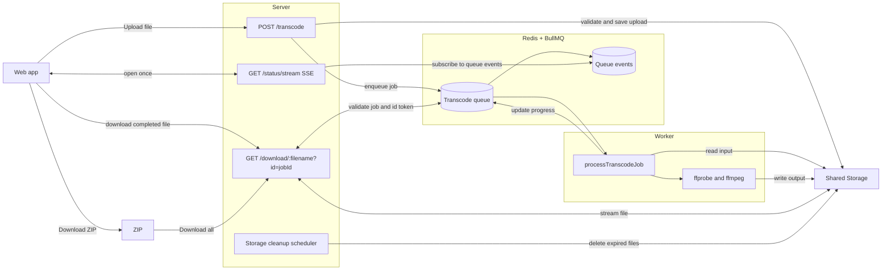

# Audio Transcoding Server

This is a simple audio transcoding application which allows to convert audio between various formats. It automatically detects the uploaded audio format and converts it to the chosen format. Currently it simply preserves any existing metadata and carries it over to the new converted files.

You can upload an entire folder, and after transcoding you can download a zip archive which will contain both the converted files and all non-audio files, so this way you can preserve the album structure.

## Running

You'll need Docker even locally for the Redis server.

- `npm run dev` starts a local server, which should be available at port `3000`. It requires you to have `ffmpeg` available
- `npm run test:client` runs tests specific to the client, which do not depend on anything
- `npm run test:server` runs tests specific to the server, and they do require to have a running Redis

To run the production version, you'll need to run these commands:

```sh
docker network create observability # external network
docker compose --env-file .env.production up -d --build
```

You can copy the `.env.production.example` file to start.

## Architecture

This app has 3 parts:

- client-side application to convert files
- server application to receive transcoding request
- worker which performs transcoding jobs by calling [ffmpeg](https://www.ffmpeg.org/)

You can read more about the application in [the docs](./docs).

### Data flow



### Client-side app

Web application is written using [Veles](https://github.com/Bloomca/veles). This is a very simple application which handles files/folder selection, uploading it to the server, displaying progress and downloading them as individual files or bundling into a single ZIP file.

### Server app

Server application receives requests to transcode files, validates and saves them, and creates a job request for each file, and allows to check on status.

- POST `/transcode` -- allows to upload a file and specify desired output. In JSON response, there is `id` property which allows to check for the status
- GET `/status/stream` -- [SSE](https://developer.mozilla.org/en-US/docs/Web/API/Server-sent_events) endpoint to check on status for all active jobs associated with the current session. The session lives in the cookie, so nothing else is required.
- GET `/download/:filename?id=%ID%` -- download the result file. You receive the `id` from uploading the file using `/transcode`, and the result filename will be available in the completed status.

### Worker app

The worker application is the one which actually handles the conversion and posts updates for specific job IDs. To receive requests, we use jobs from [BullMQ](https://bullmq.io/) (which is built on top of Redis); once the job is registered, a worker is spun to convert the uploaded file into the desired output format.

The worker updates the progress using the same job, and once it completes, it saves the file and update the job once again with the file information.